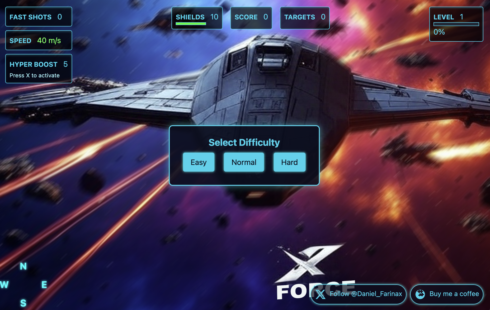
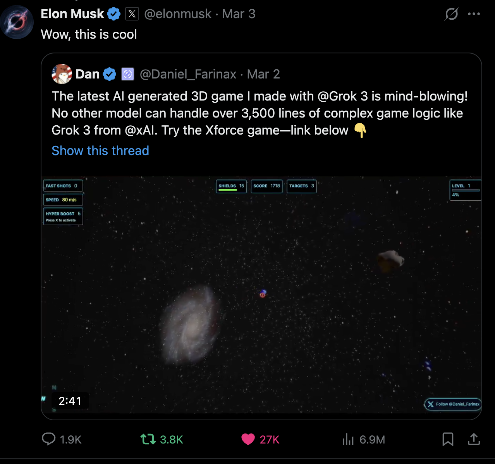

# XForce V1



This project is a recreation of the game [xforce.live](https://xforce.live) which was created using AI prompts with Grok 3. Almost zero lines of code were manually written. My posts on x went viral after Elon reteeewed two of them. Original post: https://x.com/Daniel_Farinax/status/1896253090443255870 



## Project Background

The commit history is messy and was only used as checkpoints when working on the project locally for git diff purposes.

The project was created using a basic starter prompt to create a project using TypeScript as follows:

```
Create a hello world threejs app with a plane using typescript, webpack. Create a bash script called setup.sh to get everything setup. The project should contain a simple src/app.ts file for all game logic and a public/index.html for the html part. We should be able to run in dev mode and also compile it.
```

## Getting Started

Below is an example of what the setup script might look like. For best results, ask Grok directly for detailed instructions tailored to your operating system and requirements.

### Running the Game

Once you've set up the project, you can run it using:

```bash
# Start the development server
npm run dev

# Build the project for production
npm run build
```

```bash
#!/bin/bash
# setup.sh

# Create project directory structure
mkdir -p src public dist

# Initialize npm project
npm init -y

# Install dependencies
npm install --save-dev typescript ts-loader webpack webpack-cli webpack-dev-server
npm install --save three @types/three

# Create basic tsconfig.json
cat > tsconfig.json << EOL
{
  "compilerOptions": {
    "target": "es6",
    "module": "commonjs",
    "strict": true,
    "esModuleInterop": true,
    "skipLibCheck": true,
    "forceConsistentCasingInFileNames": true,
    "outDir": "./dist/",
    "sourceMap": true
  },
  "include": ["src/**/*"],
  "exclude": ["node_modules"]
}
EOL

# Create webpack.config.js
cat > webpack.config.js << EOL
const path = require('path');

module.exports = {
  entry: './src/app.ts',
  module: {
    rules: [
      {
        test: /\.tsx?$/,
        use: 'ts-loader',
        exclude: /node_modules/,
      },
    ],
  },
  resolve: {
    extensions: ['.tsx', '.ts', '.js'],
  },
  output: {
    filename: 'bundle.js',
    path: path.resolve(__dirname, 'dist'),
  },
  devServer: {
    static: path.join(__dirname, 'public'),
    compress: true,
    port: 8080,
  },
};
EOL

# Update package.json scripts
cat > package.json << EOL
{
  "name": "threejs-hello-world",
  "version": "1.0.0",
  "description": "",
  "main": "index.js",
  "scripts": {
    "build": "webpack",
    "dev": "webpack serve"
  },
  "keywords": [],
  "author": "",
  "license": "ISC",
  "devDependencies": {
    "ts-loader": "^9.5.1",
    "typescript": "^5.4.2",
    "webpack": "^5.90.3",
    "webpack-cli": "^5.1.4",
    "webpack-dev-server": "^4.15.1"
  },
  "dependencies": {
    "@types/three": "^0.162.0",
    "three": "^0.162.0"
  }
}
EOL

echo "Setup complete! Run 'chmod +x setup.sh' and './setup.sh' to initialize the project."
echo "Then use 'npm run dev' to start the development server or 'npm run build' to build the project."
```

## Core Files

### src/app.ts
```typescript
import * as THREE from 'three';

class Game {
    private scene: THREE.Scene;
    private camera: THREE.PerspectiveCamera;
    private renderer: THREE.WebGLRenderer;
    private plane: THREE.Mesh;

    constructor() {
        // Initialize scene
        this.scene = new THREE.Scene();
        
        // Initialize camera
        this.camera = new THREE.PerspectiveCamera(
            75,
            window.innerWidth / window.innerHeight,
            0.1,
            1000
        );
        this.camera.position.z = 5;

        // Initialize renderer
        this.renderer = new THREE.WebGLRenderer();
        this.renderer.setSize(window.innerWidth, window.innerHeight);
        document.body.appendChild(this.renderer.domElement);

        // Create plane
        const geometry = new THREE.PlaneGeometry(5, 5);
        const material = new THREE.MeshBasicMaterial({
            color: 0x00ff00,
            side: THREE.DoubleSide
        });
        this.plane = new THREE.Mesh(geometry, material);
        this.scene.add(this.plane);

        // Handle window resize
        window.addEventListener('resize', this.onWindowResize.bind(this));

        // Start animation loop
        this.animate();
    }

    private animate(): void {
        requestAnimationFrame(this.animate.bind(this));

        // Rotate plane
        this.plane.rotation.x += 0.01;
        this.plane.rotation.y += 0.01;

        this.renderer.render(this.scene, this.camera);
    }

    private onWindowResize(): void {
        this.camera.aspect = window.innerWidth / window.innerHeight;
        this.camera.updateProjectionMatrix();
        this.renderer.setSize(window.innerWidth, window.innerHeight);
    }
}

new Game();
```

### public/index.html
```html
<!DOCTYPE html>
<html lang="en">
<head>
    <meta charset="UTF-8">
    <meta name="viewport" content="width=device-width, initial-scale=1.0">
    <title>Three.js Hello World</title>
    <style>
        body { 
            margin: 0; 
            overflow: hidden;
        }
        canvas { 
            display: block; 
        }
    </style>
</head>
<body>
    <script src="../dist/bundle.js"></script>
</body>
</html>
```

## Development Tips

This provides the basic instructions to get a project up and running. The key is to ask for small changes one at a time so you can learn the code and understand what's happening behind the scenes. If you encounter errors, simply paste these errors from the page, bash or web browser console to Grok and it will help you understand how to fix them.

As your game grows, you can start new chats to keep the conversation history manageable. A good example for modifying the existing game would be:

```
You: 
Do you understand my game? 
app.ts
[PASTE ENTIRE SOURCE CODE HERE]
index.html
[PASTE ENTIRE SOURCE CODE HERE]

Grok: Will breakdown and explain the game

You: Ok, can you change the amount of stars, I want 2x less stars, also can you add a sound every time we advance a level? The sound will be available on /assets/level.mp3

Provide full updated code for functions that need to be updated for the changes above.
```

This approach allows you to continue growing your file without having to get an entire updated answer with all of the code, which would take too much time or hit the limits.

## Live Demo

Check out the live demo: [xforce.live](https://xforce.live)

## License

Feel free to fork, clone, copy, and do whatever you want with this project. It's open source and we should all be helping each other rather than trying to make money with something that's buggy or part of experimentation. Eventually, it would be nice to launch something that generates income, but that's not the goal of this project.

## Support

If you find this helpful, feel free to buy me a coffee: https://buymeacoffee.com/daniel_farinax

Also make sure to follow me on Twitter: https://twitter.com/daniel_farinax

## Game Mechanics

The core of this project is the `PodRacingGame` class, which implements a 3D space shooter with the following key mechanics:

1. **Space Racing**: Players navigate a procedurally generated track through space using the WASD keys, with a camera that follows the player's spaceship.

2. **Combat System**: Players can shoot at asteroids and enemy ships using the spacebar, earning points for each destroyed object.

3. **Level Progression**: The game features multiple levels with increasing difficulty, with each level requiring the player to complete a full track.

4. **Power-ups**: Players can collect power-ups including "Fast Shot" (increased fire rate) and "Hyper Boost" (temporary speed increase with shield).

5. **Physics**: The game uses Three.js for rendering and Cannon.js for physics simulations, creating realistic movement and collisions.

6. **Enemy AI**: Enemy ships track and shoot at the player, with different enemy types including regular ships and faster "speedster" enemies.

7. **Dynamic Audio**: The game features a dynamic audio system with engine sounds that change based on speed and player actions.

8. **Visual Effects**: Explosions, particle effects, and shield visualizations enhance the gameplay experience.

9. **HUD**: A heads-up display shows important game information including lives, score, speed, and level progress.

The game implements a difficulty system with easy, normal, and hard modes, each affecting player lives, speed, and enemy behavior.

## Credits

The following resources were used during the development of this project. Some were kept in the final version, while others were only used during the learning process:

### Music
- [Ambient Dead Space Style Ambient Music](https://pixabay.com/music/ambient-dead-space-style-ambient-music-184793/)
- Music by [Julius H.](https://pixabay.com/users/juliush-3921568/?utm_source=link-attribution&utm_medium=referral&utm_campaign=music&utm_content=3595) from [Pixabay](https://pixabay.com//?utm_source=link-attribution&utm_medium=referral&utm_campaign=music&utm_content=3595)
- Music by [Yevhenii Kovalenko](https://pixabay.com/users/stereocode-31360109/?utm_source=link-attribution&utm_medium=referral&utm_campaign=music&utm_content=184793) from [Pixabay](https://pixabay.com//?utm_source=link-attribution&utm_medium=referral&utm_campaign=music&utm_content=184793)
- Music by [LCMsounds](https://pixabay.com/users/lcmsounds-23733864/?utm_source=link-attribution&utm_medium=referral&utm_campaign=music&utm_content=9391) from [Pixabay](https://pixabay.com/music//?utm_source=link-attribution&utm_medium=referral&utm_campaign=music&utm_content=9391)

### Sound Effects
- Sound Effect by [freesound_community](https://pixabay.com/users/freesound_community-46691455/?utm_source=link-attribution&utm_medium=referral&utm_campaign=music&utm_content=6879) from [Pixabay](https://pixabay.com//?utm_source=link-attribution&utm_medium=referral&utm_campaign=music&utm_content=6879)
- Sound Effect by [David Dumais](https://pixabay.com/users/daviddumaisaudio-41768500/?utm_source=link-attribution&utm_medium=referral&utm_campaign=music&utm_content=204490) from [Pixabay](https://pixabay.com/sound-effects//?utm_source=link-attribution&utm_medium=referral&utm_campaign=music&utm_content=204490)
- Enemy ship passing by sound by [worldlikeall](https://pixabay.com/sound-effects/alien-spaceship-260360/)

### Visual Assets
- Video by [Oleg Gamulinskii](https://www.pexels.com/video/mixture-of-different-colors-of-ink-in-liquid-2421545/)

### 3D Models
- **Spaceship**
  - Title: spaceship
  - Source: https://sketchfab.com/3d-models/spaceship-793d1b29675a471baea4abbdcdf4d68c
  - Author: [12598541](https://sketchfab.com/12598541)
  - License: [CC-BY-4.0](http://creativecommons.org/licenses/by/4.0/)
  - Requirements: Author must be credited. Commercial use is allowed.

*If you use this 3D model in your project be sure to copy paste this credit wherever you share it:*
This work is based on "spaceship" (https://sketchfab.com/3d-models/spaceship-793d1b29675a471baea4abbdcdf4d68c) by 12598541 (https://sketchfab.com/12598541) licensed under CC-BY-4.0 (http://creativecommons.org/licenses/by/4.0/)